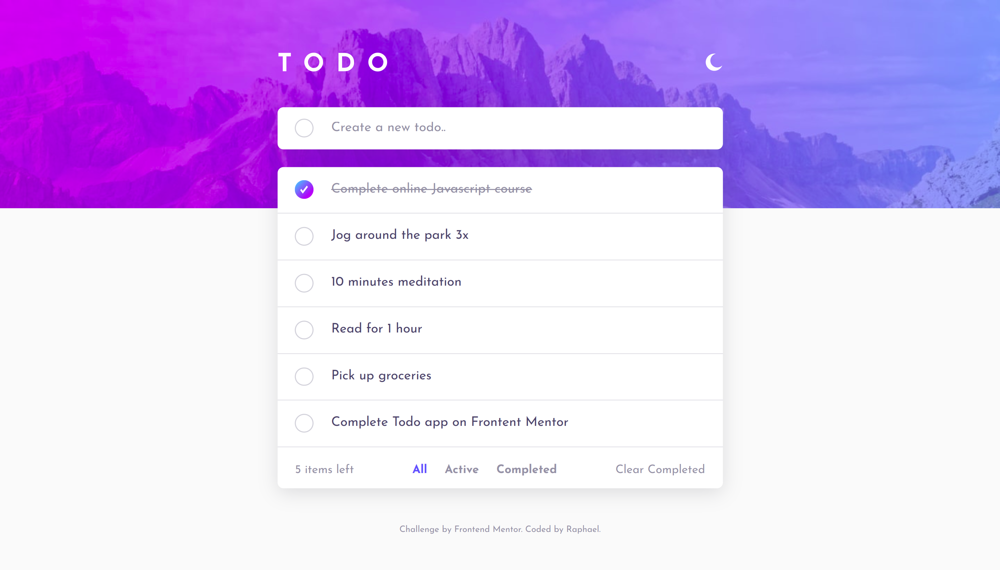
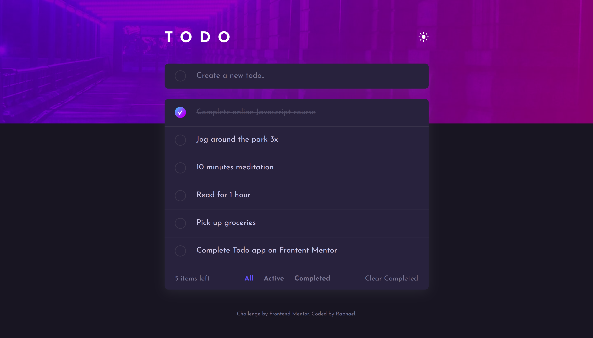
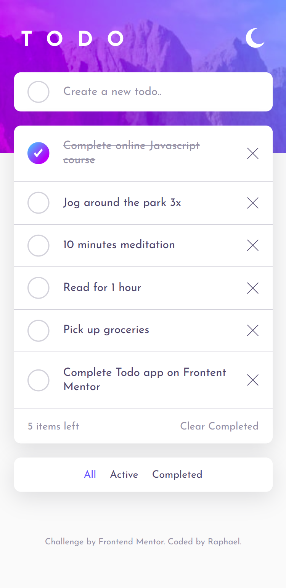
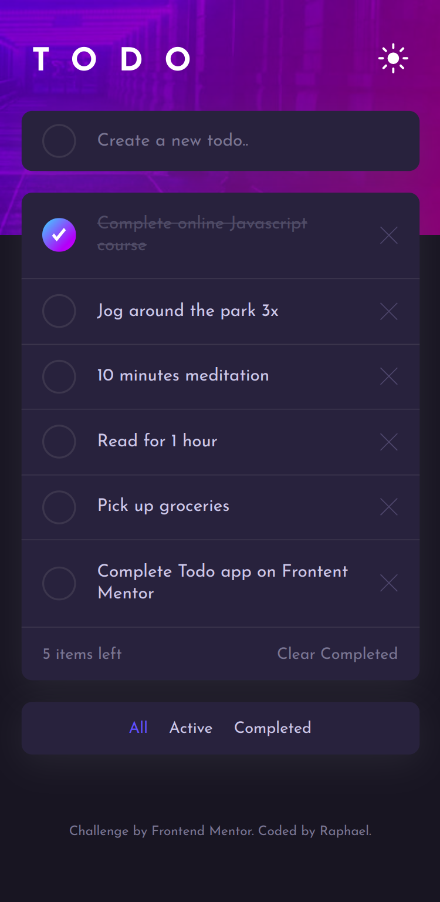

# Frontend Mentor - Todo app solution

This is a solution to the [Todo app challenge on Frontend Mentor](https://www.frontendmentor.io/challenges/todo-app-Su1_KokOW). Frontend Mentor challenges help you improve your coding skills by building realistic projects.

## Table of contents

- [Overview](#overview)
  - [The challenge](#the-challenge)
  - [Screenshot](#screenshot)
  - [Links](#links)
- [My process](#my-process)
  - [Built with](#built-with)
  - [What I learned](#what-i-learned)
- [Author](#author)

## Overview

### The challenge

Users should be able to:

- View the optimal layout for the app depending on their device's screen size
- See hover states for all interactive elements on the page
- Add new todos to the list
- Mark todos as complete
- Delete todos from the list
- Filter by all/active/complete todos
- Clear all completed todos
- Toggle light and dark mode
<!-- - **Bonus**: Drag and drop to reorder items on the list -->

### Screenshot

#### Desktop

#### Mobile

### Links

- Solution URL: [HERE](https://www.frontendmentor.io/solutions/responsive-todo-app-build-using-vue-js-eQ4cAIw_pn)
- Live Site URL: [https://todo.raelcode.com/](https://todo.raelcode.com/)

## My process

### Built with

- Semantic HTML5 markup
- CSS variables
- Flexbox
- [Vue js](vuejs.org)
- Vite - For Module bundling

**Note: These are just examples. Delete this note and replace the list above with your own choices**

### What I learned

- First project using Vue
- Theme toggling

## Author

- Frontend Mentor - [@kibzrael](https://www.frontendmentor.io/profile/kibzrael)
- Twitter - [@kibzrael](https://www.twitter.com/kibzrael)
